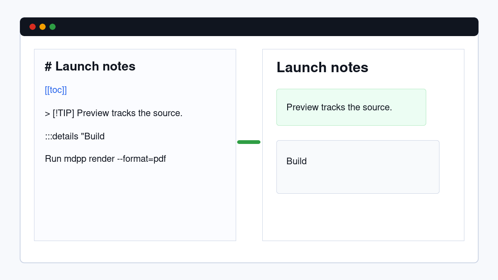
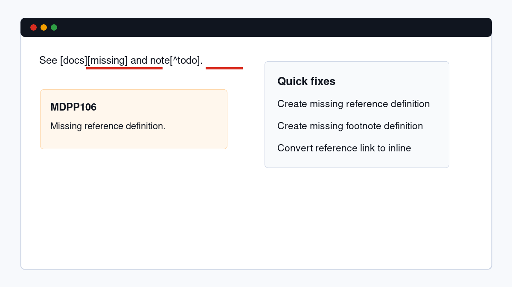
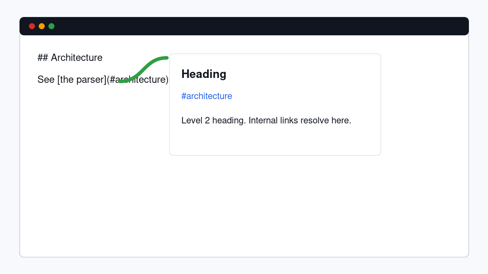
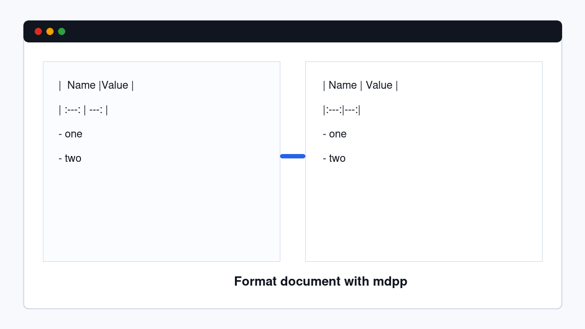

# Markdown++

The only Markdown stack with a real grammar, so hover, diagnostics, formatting, links, preview, and export understand your document instead of pattern-matching at it.



Markdown++ keeps ordinary `.md` files ordinary. Install the extension and the language server starts adding structure-aware authoring tools on top: broken-reference diagnostics, hover previews for headings and footnotes, canonical formatting, semantic tokens, a live side-by-side preview, and PDF export through the `mdpp` CLI.

This is early software. The sharp edge is also the reason it exists: Markdown++ is backed by the same gotreesitter-powered AST used by the parser, renderer, formatter, linter, and language server. When it edits a link, fixes a footnote, or syncs a preview, it is acting on syntax nodes with source ranges, not loose text matches.

## Install

Install **Markdown++** from the Visual Studio Marketplace under the `m31labs` publisher once the listing is approved.

Until then, install the packaged VSIX from the GitHub Release:

```bash
code --install-extension markdown-plus-plus-0.1.10.vsix
```

Release package: https://github.com/odvcencio/mdpp-vscode/releases/tag/v0.1.10

The extension downloads `mdpp-lsp` from the matching GitHub Release on first activation and verifies the downloaded binary against the release `checksums.txt`. To use a local server build instead, set:

```json
{
  "markdownpp.server.path": "/absolute/path/to/mdpp-lsp"
}
```

For render and PDF export commands, install the CLI:

```bash
go install github.com/odvcencio/mdpp/cmd/mdpp@latest
go install github.com/odvcencio/mdpp/cmd/mdpp-lsp@latest
```

Then make sure `mdpp` is on your `PATH`, or set:

```json
{
  "markdownpp.cli.path": "/absolute/path/to/mdpp"
}
```

## What You Get

| Feature | What it does |
| --- | --- |
| Diagnostics | Finds broken references, duplicate IDs, unsafe raw URLs, malformed directives, and other authoring problems. |
| Hover | Explains headings, links, footnotes, math, directives, embeds, and containers at the cursor. |
| Formatting | Canonicalizes Markdown while preserving code, math, raw HTML, and other format-stable interiors. |
| Code actions | Applies safe fixes and converts reference links to inline links with bounded AST-backed edits. |
| Completions | Suggests directives, containers, admonitions, frontmatter keys, references, heading anchors, and emoji shortcodes in context. |
| Semantic tokens | Highlights meaning: resolved links, broken links, footnotes, directives, containers, math, emoji, and headings. |
| Live preview | Renders engine-produced HTML beside the source and syncs scroll position in both directions. |
| PDF export | Exports the current document through the `mdpp render --format=pdf` pipeline. |







## Commands

| Command | Description |
| --- | --- |
| `Markdown++: Open Live Preview` | Opens a side-by-side preview for the active Markdown document. |
| `Markdown++: Render to HTML` | Writes rendered HTML to a file. |
| `Markdown++: Export to PDF` | Writes a PDF to a file using the configured `mdpp` CLI. |
| `Markdown++: Restart Language Server` | Restarts `mdpp-lsp` after changing binary settings. |

## Settings

| Setting | Default | Description |
| --- | --- | --- |
| `markdownpp.takeOverMarkdownLanguage` | `true` | Enables Markdown++ language features for normal Markdown files. |
| `markdownpp.preview.enabled` | `true` | Enables the live preview wiring. |
| `markdownpp.format.onSave` | `true` | Formats Markdown++ documents before save. |
| `markdownpp.server.path` | `""` | Absolute path to a manually managed `mdpp-lsp`. |
| `markdownpp.cli.path` | `"mdpp"` | CLI used by render and PDF export commands. |
| `markdownpp.binary.version` | `"v0.1.10"` | GitHub Release tag used for managed LSP downloads. |
| `markdownpp.release.baseUrl` | GitHub Releases | Base URL for managed binary downloads. |
| `markdownpp.pdf.paper` | `"letter"` | PDF paper size: `letter`, `a4`, or `legal`. |
| `markdownpp.pdf.margin` | `0.5` | PDF margin in inches. |

## Links

- Engine and CLI: https://github.com/odvcencio/mdpp
- Extension source: https://github.com/odvcencio/mdpp-vscode
- Format site: https://markdownpp.m31labs.dev
- Issues: https://github.com/odvcencio/mdpp-vscode/issues
